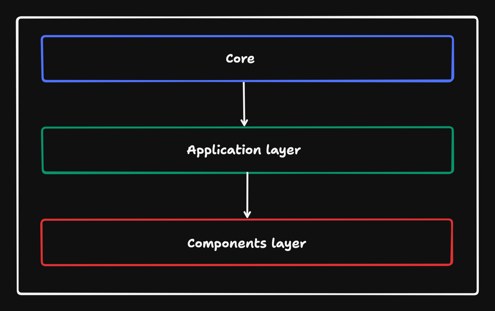

### Running the code

Step 1: Install the dependencies

```bash
# npm
npm install

# or yarn
yarn install
```

Step 2: Run application

```bash
# npm
npm run dev

# or yarn
yarn dev
```

You can see the client application running in your browser by going to http://localhost:3000.


## Tasks

### Task 1

Create a form that allows a user to submit an ISIN and add it to a watch list.

#### User Stories

> As a user, I should be able to submit an ISIN and it should be added to my watch list.

> As a user, I should not be able to subscribe to the same ISIN twice so that I don’t get confused by seeing multiple versions of the same stock.

> As a user, I should not be able to subscribe to an empty or invalid ISIN.

> Validation rules: An ISIN is a 12-character alphanumeric code. It consists of three parts: A two letter country code, a nine character alpha-numeric national security identifier, and a single check digit.
> Example:- US0378331005.

### Task 2

Create the UI and render the watch list created in the previous task to the DOM.

#### User Stories

> As a user, I should be able to view a list of my subscribed stocks displaying the latest stock price received from the WebSocket connection so that I can keep track of multiple stocks at the same time.

> As a user, I should be able to unsubscribe from a stock that’s in my watch list so that I can focus on the stocks I’m interested in.

> As a user, I should be notified if the websocket disconnects and the data is not up to date so that I know that the price is not accurate.

> As a user, I should be able to view their stocks on desktop and mobile screen widths so that I am able to use the app on my mobile browser.

### Task 3

At this point, you can consider the challenge to be complete.

This task is intentionally left open for you to add any feature you want to the application. Anything is valid, from improvements to Accessibility all the way to UI Transitions, CSS, etc.

---
| Term | Definition |
| ------------ | ------------------------------------------------------------------------------------------------------------------------------------- |
| `ISIN` | The 12-digit alphanumeric code that uniquely identifies a specific instrument |
| `instrument` | A tradable asset, or a negotiable item, such as a security, commodity, derivative, or index, or any item that underlies a derivative. |
| `bid` | The highest price a buyer will pay to buy a specified number of shares of an instrument at any given time. |
| `ask` | The lowest price at which a seller will sell the instrument. |
---

## Socket Reference

The WebSocket server is started when you run `yarn dev`. You can then connect to it at

```URL
ws://localhost:8425/
```

To subcribe to a specific security

```JSON
{
    "subscribe": "${ISIN}"
}
```

To unsubscribe to a specific security

```JSON
{
    "unsubscribe": "${ISIN}"
}
```

#### Example Request

To subscribe to the BASF instrument you would use

```JSON
{
    "subscribe": "DE000BASF111"
}
```


## Application overview


The aplicaiton consisits of layers, encapsulating different parts of the application. The depedency direction is strict from inside layer to outside. Here is the simplified schema:


`Core Layer` (located in `src/core`) keeps the domain logic of the application. It's the business crucial part and it designed to be that it easier to migrate it in any stack. Core layer it also independent from any other layer and it usualy doesn't have any external dependencies as well.
In the current application the domain-specific parts are ISIN and Instrument. So I keep core types and functions in this layer. All functions in core layer must be covered with tests.

`Application Layer` (located in `src/application`) keeps application related logic and contains functions to fullfill most user scenarios, that aren't related to UI. Usually I put here networking logic, data stores and data transformations.

In the current application Application layers consists of 3 main parts:
- subscribe - provides interfaces for subscribing to a new istruments, controlling them to avoid adding duplicates and to avoid adding instruments with the wrong ISIN. So it should cover main user scenarions related to the data.
- connection - provides the interfaces for connection and fullfills scenarions related to connection and reconnections.
- store - providers the interface to store application data and used heavily in other services to share data.

`Components Layer` (located in `src/components`) keeps UI related logic only. This is the outmost layer it consumes mostly application layer and binds it to UI.
In the UI you can find 2 types of components:
- dumb - which are simplu bulding blocks, such as [Alert](./src/components/Alert/) or [Button](./src/components/Button/).
- smart - these components are usually composition of dumbs components and they also inject the data from the application layer using ViewModels (VM in short). Examples of such components are [InstrumentForm](./src/components/InstrumentForm/) or [WatchList](./src/components/WatchList/).

The core idea of slicing the application into layers is to make it strict borders between different parts of the application. This approach allows for a cleaner separation of concerns and also helps to developer application from the most crucial part to the least. For example, when I started this application from describing the core layer and then went to the application and at the last step I made decisions about UI. Therefore I already had core logic ready, so the most important decisions were already made early.

Layering application also creates an oportunity to swap some of the application parts or even whole layers if you keep the proveded interfaces the same. Please notice that every dependency using interfaces only (e.g. [WebSocketSubscriptionService](./src/application/subscribe.ts)), no depedency knows about the final implementation. Such an approach helps me to first design what I want, and then decide on how to do it. It also helps me to easly mock any implementation I want for tests, see [subscritbe.test.ts](./src/application/subscritbe.test.ts) for example.

Small note about tests. There is not much thigns to test, but as I said the most tested part must be the core layer. With only 1 function provided from there it should be enough for this layer. For the application layer I decided to only provide a bunch of test to a couple of user scenarions, but tried to test as a blackbox.
